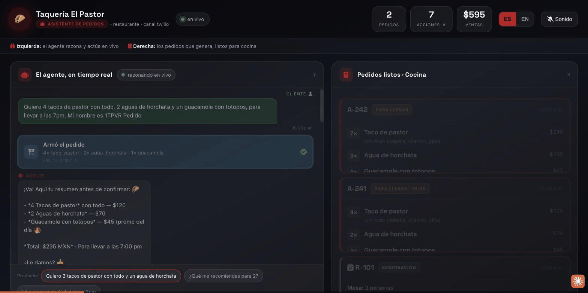

# 🌮 Asistente de Pedidos — WhatsApp ordering + reservations on a shared Claude runtime

A WhatsApp agent that takes food orders in CDMX Spanish, upsells, computes the total
**deterministically (tool-side, never LLM math)**, books tables, and emits a structured
kitchen/POS ticket — then **flips one config line** to become a real-estate agent on the
*exact same engine*. That flip is the pitch: one backend, white-labeled to any business.

```
WhatsApp ──▶ webhook (Twilio | Meta) ──▶ shared Claude tool-use runtime ──▶ tools ──▶ structured event
   ▲                                              │                          (ticket / reservation /
   └──────────── reply (es-MX) ◀──────────────────┘                           viewing / lead)
                                                                                     │
                                              live ops board (SSE)  ◀────────────────┘
```

The runtime, channel adapters, session, prompt assembly and event bus are **identical** for
every business. A business is just a `configs/*.json` (persona + rules + which tool pack +
knowledge file). Swap the config → new business in minutes.

---

## Demo



- 🔴 **Demo en vivo (tablero de cocina):** [asistente-pedidos-production.up.railway.app/kitchen](https://asistente-pedidos-production.up.railway.app/kitchen)
- 📄 **Detalles:** [asistente-pedidos-showcase.vercel.app](https://asistente-pedidos-showcase.vercel.app/)
- ▶️ **Video:** [youtu.be/Idg40dF3FZE](https://youtu.be/Idg40dF3FZE)

---

## TL;DR for tomorrow

```bash
npm install
cp .env.example .env          # add ANTHROPIC_API_KEY (+ channel creds)
npm run validate              # preflight: configs, menu, PRD math = $170
npm test                      # 15 deterministic tests + 5 channel smoke checks
npm run demo                  # offline scripted taquería flow (your safety net)
npm start                     # boot webhook server + ops board on :8080
```

Open the projector on **http://localhost:8080/kitchen**, message the WhatsApp number, watch
the ticket land live.

> **No internet on stage? You're still covered.** `npm run demo` runs the full taquería flow
> with the **real tools** (real totals, real emitted ticket) and zero network. See
> [Fallback](#fallback-if-the-wifi-dies).

---

## 5-minute deploy

You need: Node ≥ 20, an `ANTHROPIC_API_KEY`, and a public HTTPS tunnel (`ngrok http 8080`).
Pick **one** channel. Both provision a usable WhatsApp number instantly — no business
verification required for the demo.

### Option A — Twilio WhatsApp Sandbox (fastest)

1. `.env`: `CHANNEL=twilio`, `BUSINESS=taqueria-el-pastor`, `TWILIO_VALIDATE_SIGNATURE=false`
   *(the sandbox replies via TwiML, so no outbound Twilio creds are needed to start).*
2. `npm start`, then `ngrok http 8080` and copy the `https://…ngrok…` URL.
3. **Twilio Console → Messaging → Try it out → WhatsApp sandbox settings.** Set
   *"When a message comes in"* to `https://<ngrok>/webhook/twilio` (HTTP **POST**).
4. From your phone, WhatsApp the sandbox number (`+1 415 523 8886`) the join code shown in
   the console (e.g. `join silver-tiger`).
5. Message it: *"buenas, quiero pedir"* → you're live.

*To enable signature validation: set `TWILIO_VALIDATE_SIGNATURE=true`, `TWILIO_AUTH_TOKEN=…`,
and `PUBLIC_URL=https://<ngrok>`.*

### Option B — Meta WhatsApp Cloud API (free test number)

1. **developers.facebook.com** → create app (type *Business*) → add **WhatsApp**. Copy the
   **test number's** `phone_number_id`, a temporary **access token**, and add your personal
   number as an allowed recipient (test mode allows up to 5).
2. `.env`: `CHANNEL=meta`, `META_PHONE_NUMBER_ID=…`, `META_ACCESS_TOKEN=…`,
   `META_VERIFY_TOKEN=<any-string>`, `META_GRAPH_VERSION=v22.0`.
3. `npm start` + `ngrok http 8080`.
4. In the WhatsApp product → **Configuration → Webhook**, set callback URL
   `https://<ngrok>/webhook/meta` and the verify token to your `META_VERIFY_TOKEN`; **subscribe
   to `messages`**.
5. Message the test number from your allowed phone.

> **Production note (post-demo):** a *branded* production number requires Meta Business
> verification (days, not hours) on either channel. The sandbox/test number above is the right
> tool for a live pitch; productionizing the number is a separate step.

---

## The demo (see `DEMO.md` for the stage cue-card)

**Act 1 — Order tacos on WhatsApp.** Type, in order:

```
buenas, quiero pedir para llevar
3 tacos de pastor y un agua de horchata
sí, con todo
va                       ← accepts the guacamole upsell
para llevar, 2pm
```

The agent confirms the order, lands the **$170** total, and a structured ticket **pops onto
the kitchen board** with a ding. Then show the 86 guardrail:

```
¿tienen quesabirria?     ← it's sold out (disponible:false) → agent won't sell it
```

**Act 2 — The flip.** Stop the server, change one line in `.env`:

```
BUSINESS=inmobiliaria-cdmx
```

`npm start`, reload the board. **Same number, same engine** — now it's a real-estate concierge:

```
hola, busco depa en renta en la Condesa
2 recámaras, hasta 40 mil
agéndame una visita el jueves a las 5pm
```

A **viewing** card appears on the same board. The line that wins the room:
*"Same backend. We flipped one config file. That's the white-label model — your taquería
customer and your real-estate customer run on one system we maintain once."*

---

## Why this architecture sells

- **Deterministic money.** Totals, promos (guac $55→$45), paid modifiers (+$12 queso) and
  86'd items are computed in `src/tools/restaurant.ts` — the model *never* does arithmetic.
  Proven by `npm test` (the PRD order is asserted at exactly `$170`).
- **Grounded.** The agent only sells real, available menu items at real prices; the menu is
  injected into the system prompt and enforced by the tools.
- **One engine, many businesses.** `taqueria-el-pastor`, `la-mesa-fina` (fine-dining persona),
  `inmobiliaria-cdmx` (real estate) all run the same `src/agent.ts`.
- **Structured output.** `emit_ticket` produces a POS-ready JSON contract
  (`schemas/ticket.schema.json`) any kitchen display or POS can consume.

---

## Project layout

```
configs/                  the white-label surface — one JSON per business
  taqueria-el-pastor.json  · restaurant: ordering, upsell, reservations, ticket
  la-mesa-fina.json        · restaurant tools, fine-dining persona (shows tone range)
  inmobiliaria-cdmx.json   · real-estate tools (the flip)
data/                     knowledge files referenced by configs
  menu.taqueria.json       · 22-item CDMX menu, promos + 2 items 86'd
  menu.finedining.json     · small upscale menu
  listings.cdmx.json       · 8 CDMX properties (renta/venta)
schemas/ticket.schema.json structured kitchen/POS ticket contract (JSON Schema)
src/
  agent.ts                 the shared Claude tool-use loop (only SDK importer)
  prompt.ts                builds persona + rules + grounded knowledge from config
  tools/restaurant.ts      get_menu, add_to_order, create_order, emit_ticket, book_table, handoff_human
  tools/realestate.ts      get_listings, schedule_viewing, qualify_lead, handoff_human
  channels/twilio.ts       inbound parse + HMAC-SHA1 signature + TwiML reply (zero-dep)
  channels/meta.ts         inbound parse + verify handshake + Graph send (zero-dep)
  server.ts                webhook routes + SSE ops feed + board
  config.ts session.ts bus.ts types.ts
web/kitchen.html           the live ops board (SSE, animated, plays a ding)
scripts/                   simulate (REPL + offline demo), test, validate, check-channels
```

## Commands

| command | what it does |
|---|---|
| `npm run validate` | preflight every config/menu/listing; verifies the PRD math |
| `npm test` | 15 deterministic domain tests + 5 channel smoke checks (no network) |
| `npm run demo` | offline scripted taquería flow with real tools — **stage fallback** |
| `npm run simulate` | live REPL against the real model (`ANTHROPIC_API_KEY` required) |
| `npm run simulate -- --business=inmobiliaria-cdmx` | REPL as the real-estate agent |
| `npm start` | boot the webhook server + ops board |
| `npm run typecheck` | `tsc --noEmit` (needs `npm install` for `@types`) |

## Model & cost

Default `MODEL=claude-sonnet-4-6` — the latency/quality sweet spot for a snappy WhatsApp
agent. Drop to `claude-haiku-4-5-20251001` for lower cost/latency, or `claude-opus-4-8` for the
hardest reasoning. Each turn is short (`max_tokens: 1024`) and the menu is injected once, so
per-order cost is low.

## Guardrails (enforced in tools + prompt)

Sells only real, **available** items at real prices · totals computed tool-side · confirms full
order + total before `create_order` · allergen/medical questions answered from menu data or
handed off (no medical advice) · out-of-hours orders scheduled · `handoff_human` for anything
out of scope.

## Notes

- Runs on **TypeScript via Node's native type-stripping** — `tsx` is only used for the dev
  server convenience; the test/validate/demo scripts run on stock `node`.
- Session state is in-memory (one `Map`) for the demo. Swap `SessionStore` for Redis/Postgres
  in production — single interface, single file.
- `scripts/_chk.ts` is a deprecated alias of `scripts/check-channels.ts`; safe to delete.
- Out of scope (phase 2, per PRD): live POS integration, payment links, delivery dispatch,
  inventory-driven 86'ing, loyalty.
